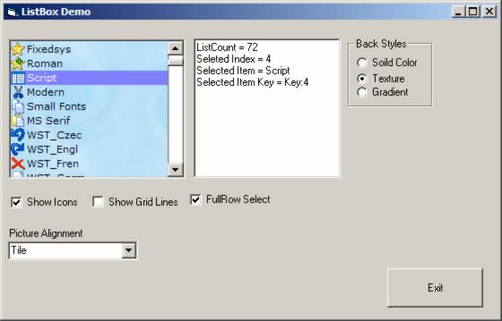



## Custom Listbox

### Description

Custom Listbox I made about 4 months back and stopped working on it the listbox works by rendering all the items into to a picturebox and n other controls are used. it supports a load of properties, Forecolor, backcolor, Images, Background images with alignments, Gradient background, Gridlines , also supports loads of functions like a normal listbox, additem, finditem, delete item, move item, append items Keyboard support and much more. Hope you like it,
 
### More Info
 

             |
---                |---
**Submitted On**   |2001-09-07 14:14:32
**By**             |[dreamvb](https://github.com/Planet-Source-Code/PSCIndex/blob/master/ByAuthor/dreamvb.md)
**Level**          |Beginner
**User Rating**    |5.0 (40 globes from 8 users)
**Compatibility**  |VB 6\.0
**Category**       |[Graphics](https://github.com/Planet-Source-Code/PSCIndex/blob/master/ByCategory/graphics__1-46.md)
**World**          |[Visual Basic](https://github.com/Planet-Source-Code/PSCIndex/blob/master/ByWorld/visual-basic.md)
**Archive File**   |[Custom\_Lis199843632006\.zip](https://github.com/Planet-Source-Code/dreamvb-custom-listbox__1-65554/archive/master.zip)

